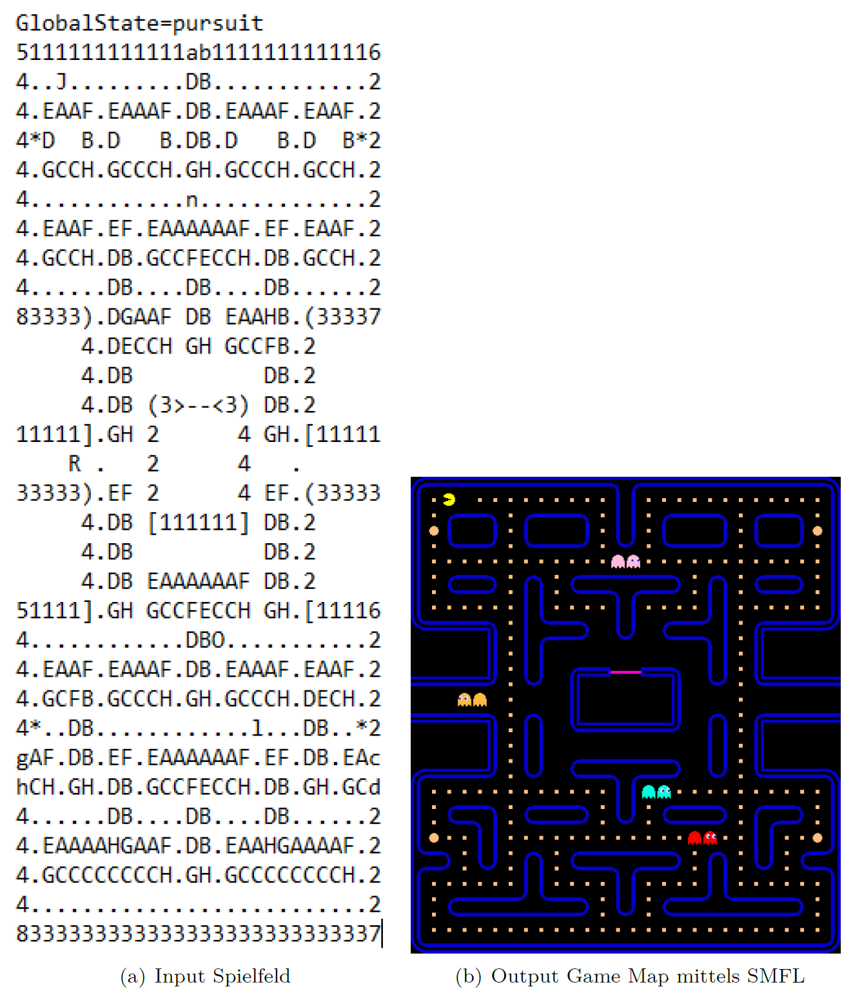
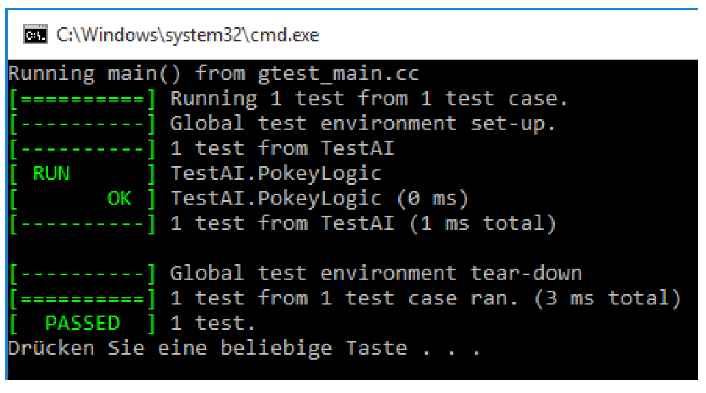

# pacman-ai

In this project the basic pacman (ghost) behavior is implemented and demonstrated with a test map. The game could be modified to be a fully playable solution. Moreover, Google Unit Testing is executed (demo purpose).

https://youtu.be/QxTmpNPwc7c

Sprite sheet is included. Game UI with SFML 2.3.2 (https://www.sfml-dev.org/).

## Game

## Unit Test

## Tasks

### Input
1. read GameMap ("*TestMap.txt*") with current GameState (pursuit/patrol/escape)
2. each Ghost is represented with a special Char-Array (one letter/direction)
3. save GameMap
### Processing
1. sensorik reads info from memory
2. calculate the current movement- and viewing direction
3. old location is replaced with an empty space
### Output
1. draw GameMap with Tile-set
2. replace old location with empty sprite (draw also ghost shadow)
3. save GameMap as picture

PacMan_AI.cpp ist the main file.

1. PacMan_AI.exe: < TestMap.txt > necessary
2. PacMan_AI.exe with Command Line: 

   PacMan_AI.exe −−load TestMap.txt

   unitTest_Pacman.exe 
